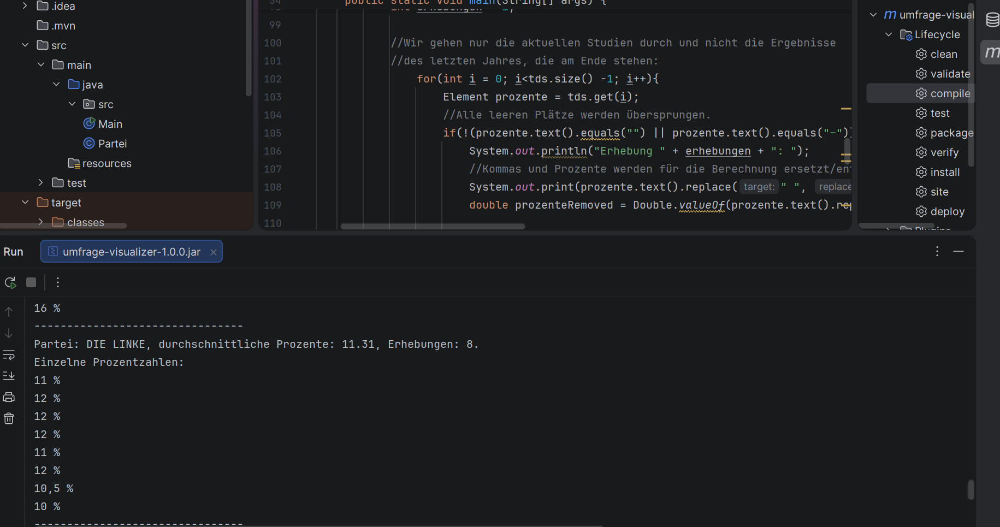

# WahlergebnisseAlsDiagramm
Dies ist mein erstes Coding-Projekt und erstes GitHub-Projekt überhaupt, demnach kann der Code schlecht geordnet oder unverständlich wirken - die Kommentare innerhalb des Codes helfen allerdings. Alle Credentials von - und ein großes Dankeschön an die ehrenamtlichen Betreiber der Website und den jeweiligen Instituten.

Dieses Programm scraped automatisch die aktuellen durchschnittlichen Bundeswahlergebnisse einzelner Parteien in der Sonntagsfrage von https://www.wahlrecht.de/umfragen/ und zeigt sie in einem Balkendiagramm an. Die einzelnen Prozentzahlen der Institute und die Anzahl der Erhebungen und  werden zudem der Verständlichkeit halber in der Konsole angezeigt.

Ich habe es geschrieben, da ich mit der Darstellungsweise der am meisten genutzten, aktuellsten und vermutlich vertrauenswürdigsten Website der Sonntagsfrage unzufrieden war, weil auf ihr ein Diagramm und die Durchschnittswerte der Parteien fehlten, und natürlich, um selbst mit Scrapern, UIs und anderem in Java zu lernen.

# Screenshot

# Features
- Scrapen der Website mit JSoup
- Berechnen des Durchschnittswertes jeder Partei
- Visuelle Grafik der Ergebnisse durch JFreeChart

# Voraussetzungen
- Java 17+
- JSoup
- JFreeChart

# Bekannte Einschränkungen
Der Scraper funktioniert nur auf der spezifischen Seite der bundesweiten Ergebnisse und wirft bei Benutzen auf anderen Websites einen Fehler aus. Er kann auch bei Layout-Änderungen der Website kaputtgehen.
